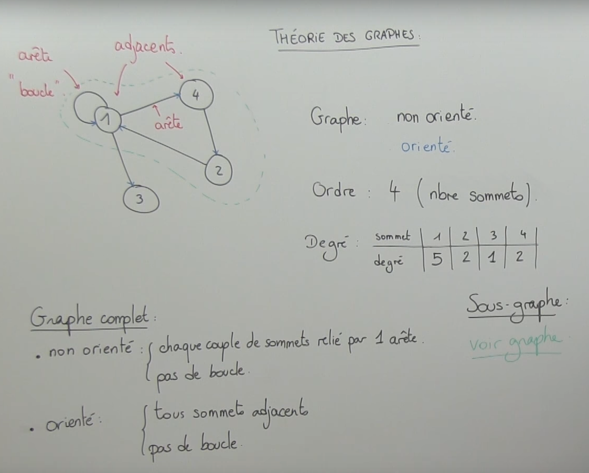

# UE3_Prosit4 - Graphes et algorithmes de routage

## Team
 * Animateur - Nicolas
 * Secrétaire - Hugo
 * Scribe - Fantou
 * Gestionnaire - Maxou

## Mots-Clés
 * Congestion : 
 * Algorithme de Dijkstra : 
 * Routage Dynamique : 
 * Théorie des graphs : 
 * Algorithme distribué (à état de lien) : 
 * Protocole RIP : 
 * Protocole Propriétaire : 
 * Protocole Ouvert : 
 * Algorithme de type vercteur de distance : 
 * Matrice : 
 * Authentification : 
 * Coût : 
 * Nombre de saut : 
 * Arretes et sommets : 

## Contexte
### Quoi ?
 * Problème de congestion

### Pourquoi ?
 * Eviter les problèmes de congestion
 * Fluidifier le trafic

### Comment ?
 * Calculer le chemin le plus court

## Contraintes
 * Matériel constructeur **Cisco**

## Problématique
 * Comment éviter les problèmes de congestion et fluidifier le trafic réseau via la théorie des graphes ?

## Généralisation
 * ~~MCO~~
 * Optimisation

## Hypothèses
 * Le chemin le plus court va réduire les congestions
 * Les différents protocoles disponibles utilisent chacun un moyen différent pour identifier la meilleur route
 * Chemin avec la plus grande bande passante
 * Différents critères pour le chemin le plus adapté
 * On peut utiliser plusieurs chemin pour un même **paquet**
 * On peut utiliser plusieurs chemin pour un même **segment**
 * Un routeur utilise les distances administratives pour sélectionner la route à utiliser
 * Parcours en profondeur
 * Dijkstra fait la sommes des poids des arretes et continu à avancer d'arrete en arrete tant que le poids des arretes parcourues est inférieure au poids total des poids des arretes précédentes

## Plan d'Action
### Etudes
 * Routage dynamique

 * Protocole dynamique (RIP, OSPF, IGRP, EIGRP)
 Un protocole de routage dynamique est un des moyens permettant de remplir une table de routage. il communique avec les autres routeurs les informations de sa propre table et récupère les informations de celles des autres pour mettre sa table à jour.
 	 * RIP : (Routing Information Protocol) Est un protocole de routage dont la distance administrative de base est 120. On utilise aujourd'hui sa version 2. Métrique basée sur le nombre de sauts. Métrique maxi = 15. Les mises à jour entre routeurs s'effectuent toutes les 30 secondes par l'envoi des tables de routage entières, envoyées en broadcast pour RIPv1 et à l'adresse 224.0.0.9 en RIPv2.  
 	 Lorsqu'une route est sans annonce depuis plus de 180s, elle est définie comme "perdue" et marquée par une métrique infinie, c'est le délai "invalid". "Flush" est le délai avant que la route ne soit supprimer de la table de routage, par défaut 240s. "Holddown" est le délai après qu'une route soit tombée avant qu'elle ne soit remplacée et que le routeur fasse confiance à une autre route, par défaut 180s.  
 	 Différence entre Rip v1 et v2 : v2 supporte le VLSM puisqu'il transmet les mask, l'authentification, en clair ou en crypté, envoi des màj en multicast au lieu de broadcast, réduisant la charge rseau.  
 	 Problèmes liés au protocle RIP : Limite de 15 sauts, l'envoi de l'entièreté des tables consomme beaucoup de bande passante, convergence plus lente qu'OSPF, ne prend pas en compte les paramètres de délai et de coût, pas de concept d'area ou de frontière.  
 	 Activation de RIP v2 : 'router rip; version 2; network **192.168.1.0**; passive-interface g0/0'  
 	 Pour plus de détails, voir résumé Cisco CCNA2, chapitre 3.

 	 * OSPF : (Open Shortest Path First) Est un protocole de routage dynamique, convergeant très rapidement, de distance administrative 110. C'est un protocole non propriétaire, contrairement à son concurrent chez Cisco, EIGRP. Fonctionne avec l'agorithme de Dijkstra.  
 	 Pas de distance maximale (saut) comme avec RIP, chaque routeur connait l'entièreté de sa zone (area). OSPF supporte le VLSM ainsi que l'agrégation et la "summarization" de routes. il utilise le multicast pour envoyer ses mises à jours, qui sont à état de lien, elles ne sont envoyées que lors d'un changement de topologie, économisant de la bande passante. Converge plus rapidement car les changement de topologie sont propagés instantanément. Il est aussi plus efficace en load balancing (répartition de paquets via plusieurs chemins). Le choix du meilleur chemin est basé sur le coût (bande passante) de la route.  
 	 un routeur OSPF remplit un rôle et une responsabilité particulière qui dépend de la hiérarchie OSPF établie :
 	 	 * Internal Router (IR) : Remplit des fonctions au sein d'une zone uniquement, autre que la zone Backbone. Il entretient à jour avec tous les réseaux de sa zone sa base de données d'état de lien qui est identique sur IR de la zone. Il renvoie toutes ses informations aux autres routeurs de la zone, le changement de zone requiert un ABR (Area Border Router)
 	 	 * Backbone Router (BR) : Une des règles de conception OSPF est que chaque zone (area) dans l'interréseau doit être connectée à une seule zone, la zone 0 ou la backbone area. Les BR ont une interface connectée à la backbone area.
 	 	 * Area Border Router (ABR) : Possède au moins deux zones dont l'area 0. Il possèfe autant de base de données d'état de lien que d'interfaces connectées à des zones différentes. Chacune des bases contient l'intégralité de la topologie de la zone connectée qui est donc "summarizée", agrégée en une seule route IP.
 	 	 * Autonomous System Boundary Router (ASBR) : OSPF devra être connecté à l'internet par d'autre "autonomous system". Il fait office de passerelle vers un ou plusieurs "AS".  
 	 Fonctionnement OSPF :  
 	 * Étape 1 : Découverte des voisins
	   D'abord, l'interface d'un routeur doit trouver ses voisins et entretenir une relation avec chaque voisin L2.  
	   Il utilise des paquets Hello.  
	   Dès son initialisation ou à la suite d'un changement dans la topologie, un routeur va générer un link-state advertisement (LSA).  
	   Cette annonce va représenter la collection de tous les états de liens de voisinage du routeur.

	 * Étape 2 : Inondations et mises à jour  
	   Tous les routeurs de la zone (area) vont s'échanger ces états de liens par inondation (flooding).  
	   Chaque routeur qui reçoit des mises à jour d'état de lien (link-state update), en gardera une copie dans sa link-state database et propagera la mise à jour auprès des autres routeurs.

	 * Étape 3 : Calcul des routes  
	   Après que la base de données de chaque routeur a été complétée, chacun va calculer l'arbre du chemin le plus court (Shortest Path Tree) vers toutes les destinations avec l'algorithme Dijkstra.  
	   Il construira alors la table de routage (routing table), appelée aussi forwarding database, en choisissant les meilleures routes à inscrire.

	 * Étape 4: Maintenance des routes  
	   S'il n'y a pas de modification topologique, OSPF sera très discret.  
	   Par contre en cas de changement, il y aura échange d'informations (par des paquets d'état de lien) et l'algorithme Dijkstra recalculera les chemins les plus courts à inscrire dans la table de routage.

	 * EIGRP : (Enhanced Interior Gateway Routing Protocol) Protocole propriétaire Cisco. Supporte le VLSM, fonctionne avec l'algorithme DUAL, transmission en multicast (224.0.0.10) et unicast, supporte IPv4/6 /AppleTalk / IPX, Load-balancing, "summarization" à n'importe quel endroit du réseau, "auto-summarization" entre réseaux majeurs, messages entre routeurs assurés par RTP (Reliable Transfer Protocol), métrique tient compte de la bande passante et du délai des interfaces, distance administrative interne = 90, distance administrative externe = 170.  
	 EIGRP fonctionne sur le système d'ASN (Autonomous System Number), il pourra communiquer qu'avec les routeurs ayant configuré EIGRP avec le même ASN.  
	 Fonctionnement EIGRP :
	 	 * Une fois activé sur une interface, EIGRP tente de découvrir les voisin potentiels avec des messages "HELLO". Lorsqu'ils reçoivent les messages "HELLO" l'un de l'autre, les deux routeurs vérifient les conditions nécessaire à ce qu'ils deviennent "voisins EIGRP" : Fonctionnent avec le même ASN ; Ils doivent s'envoyer et recevoir des paquets IP ; Interfaces configurées avec des IP dans le même subnet ; L'interface en question ne doit pas être passive ; Les valeurs définissant le calcul de la métrique doivent correspondre (valeurs K) ; L'authentification EIGRP si elle est configurée doit être passée avec succès.

 * Métriques utilisés pour évaluer les routes

 * Théorie des graphes :
 Un graphe est constitué de sommets et d'arrêtes reliant les sommets entre eux, les rendant adjacent. Les arêtes peuvent également former des **boucles** en partant d'un sommet pour y retourner.  
 Si les arêtes n'ont pas d'orientation, le graphe est dit non orienté. A contrario, si les arêtes ont un sens, le graphe est dit orienté.  
 L'ordre d'un graphe, cela correspond à son nombre de sommets.  
 Le degré d'un sommet, cela correspond au nombre d'arrete dont il est l'extrémité. (**Attention**, dans les boucles, le sommet est l'extrémité du départ de la boucle et de son arrivé, son degré augmente donc de deux et non pas d'un)  
 Pour qu'un graphe soit dit "**complet**" : Si c'est un graphe non orienté, chaque couple de sommets doit être relié par **une** arête unique et ne pas contenir de boucle. Si c'est un graphe orienté, tous les sommets doivent être adjacents et il ne doit pas y avoir de boucle.
 Un sous graphe c'est un sous ensemble de sommet ainsi que les arêtes les reliants (y compris les boucles)
 

  * Algorithme destribué à l'état de lien

  * Dijkstra

 * Implémentation des protocoles chez Cisco

 * Distances administratives

### Réalisation
 * Matrice pour trouver le meilleur chemin
 * Workshop
 * Corbeille (*Avec Kim*)
 * *Facultatif : Dijkstra en Java*