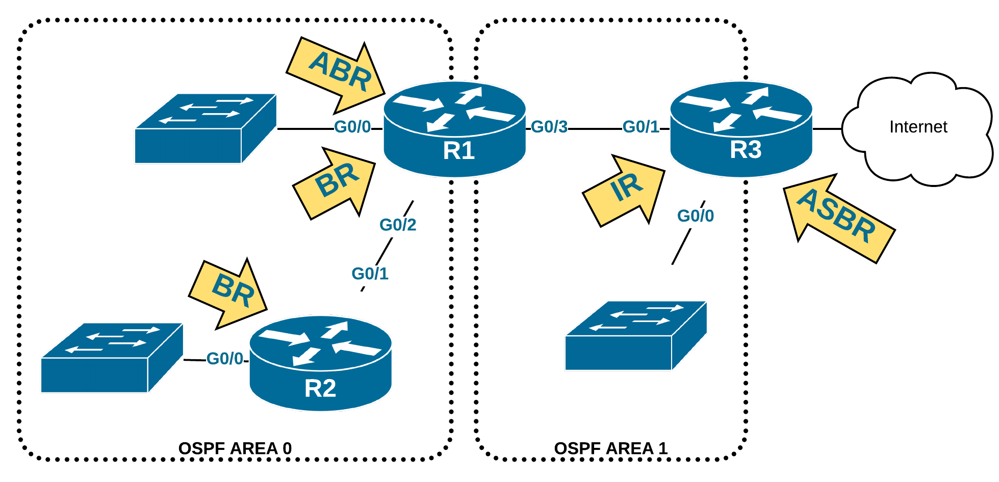

# UE3_Prosit4 - Graphes et algorithmes de routage

# Team
 * Animateur - Nicolas
 * Secrétaire - Hugo
 * Scribe - Fantou
 * Gestionnaire - Maxou

# Mots-Clés
 * Congestion : bouchon
 * Algorithme de Dijkstra : algo de shortest path
 * Routage Dynamique : 
 * Théorie des graphs : 
 * Algorithme distribué (à état de lien) : 
 * Protocole RIP : routing information protocol, vecteur de distances
 * Protocole Propriétaire :  protocole détenu par une marque fonctionnant uniquement sur ses équipements
 * Protocole Ouvert : protocole open source fonctionnant sur les équipements d'une multitude (tous ?) de constructeurs
 * Algorithme de type vercteur de distance : 
 * Matrice : 
 * Authentification : 
 * Coût : -
 * Nombre de saut : nombre de routeur par lequel la trame passe
 * Arrêtes et sommets : composants d'un graphe

# Contexte
### Quoi ?
 * Problème de congestion

### Pourquoi ?
 * Eviter les problèmes de congestion
 * Fluidifier le trafic

### Comment ?
 * Calculer le chemin le plus court

# Contraintes
 * Matériel constructeur **Cisco**

# Problématique
 * Comment éviter les problèmes de congestion et fluidifier le trafic réseau via la théorie des graphes ?

# Généralisation
 * ~~MCO~~
 * Optimisation

# Hypothèses
 * Le chemin le plus court va réduire les congestions
 * Les différents protocoles disponibles utilisent chacun un moyen différent pour identifier la meilleur route
 * Chemin avec la plus grande bande passante
 * Différents critères pour le chemin le plus adapté
 * On peut utiliser plusieurs chemin pour un même **paquet**
 * On peut utiliser plusieurs chemin pour un même **segment**
 * Un routeur utilise les distances administratives pour sélectionner la route à utiliser
 * Parcours en profondeur
 * Dijkstra fait la sommes des poids des arretes et continu à avancer d'arrete en arrete tant que le poids des arretes parcourues est inférieure au poids total des poids des arretes précédentes

# Plan d'Action
## Etudes

### **Routage dynamique**
### **Protocole dynamique (RIP, OSPF, IGRP, EIGRP) :**

####**RIP**

Routing Information Protocol: protocol de routage IP de type Vector Distance s'appuyant sur l'algorithme de Bellman-Ford.  

Protocole à vecteur de distance : 

* les routeurs envoient leur table de routage aux voisins
* sensible aux boucles de routage
* non centralisé (pas de routeur spécial)
* converge lentement

RIP permet à chaque routeur de communiquer aux routeurs voisins la distance qui les sépare d'un réseau IP donné. Pour chaque réseau connu le routeur conserve l'adresse du routeur voisin dont la métrique est la plus petite.

RIP existe en 3 versions:

* la première, définie dans la RFC 1058, ne supportait ni le VLSM ni l’authentification des routeurs. Les routes étaient envoyés en broadcast

* RIPng qui supporte IPv6, l'authentification IPSEC et le multicast

* RIPv2, définie dans la RFC 2453. Conçue pour être compatible avec les réseaux actuels (VLSM, authentification)

Les routes sont envoyées à l'adresse multicast 224.0.0.9

métriques: RIP utilise l’algorithme de Bellman-Ford 

* la distance administrative est 120 par défaut
* la métrique est basée sur le nombre de sauts
* la métrique maximale est 15
* la métrique infinie est 16, elle "empoisonne" une route (fait qu'on ne l'utilise pas)

**boucle de routage :** route diffusée pour des paquets qui n'atteignent jamais leur destination, ils tournent en boucle sur les même noeuds. Causé par une convergence trop lente des informations de routage

solutions:

* définir une nombre maxde sauts
* route poisoning : lorsqu'une route vers un réseau tombe le réseau est averti d'une métrique de distance infinie (max hops+1)
* Split horizon : toutes les interfaces d'un routeur sont censées envoyer des MAJ de routage, Split horizon empêche d'envoyer des info
* Triggered Update : une MAJ est envoyée immédiatiemment lorsqu'une route tombe. Assure que tous les routeurs ont connaissance des routes tombées avant qu'un compteur n'expire
* Split Horizon avec poison reverse: avertit toutes les routes sortantes d'une interface, mais celles apprises d'une MAJ plus récente sont marquées d'une métrique distance infinie

**compteurs :**

* update: délai de maj, 30 s par défaut 30 s
* invalid : on considère une route invalide après un certain délai sans annonce, 180s par défaut
* flush : délai avant retrait de la route de la table de routage
* holddown : délai d'attente après lequel une route à métrique + élevée est prise en compte, 180 par défaut

En-tête: un message RIP est composé d'une en-tête suuivie d'1 à 25 (24 si un est utilisé pour l'authentification)
 sur l'interface sur laquelle il a appris 

* Commande : requête/réponse ou diffusion.
* Domaine de routage : permet de découper le réseau en sous-réseaux logiques.
* Marqueur de route : marqueur qui peut être utilisé pour distinguer les routes apprises en interne par RIP de celles apprises par d’autres protocoles (par exemple OSPF).
* Métrique : distance de la route compris entre 1 et 15 (16 étant l'infini).
* Version : indique la version du protocole utilisé, 1 ou 2.

**config:**

	router rip
	version 2
	network 192.168.1.0
	passive-interface G0/0

active RIPv1, le passe en version 2, active l'émission et la réception de messages, passive interface désactive l'envoie de messages auto

limitations : 

* pour éviter les boucles de routage le nombre max de sauts est 15, on drop les paquets au delà
* ne prends en compte que les hops

ces limitations sont corrigées par OSPF

#### **Algorithme distribué à l'état de lien**

routage à état de lien:

utilise un algo plus efficace que le shortest path, les routeurs collectent l'ensemble des coûts des liens (interfaces) et construisent de leur POV l'arbre de tous les chemins possibles et les meilleures sont ajoutées à la table de routage. Ce genre d'algo converge très rapidement.

l'état d'un lien est une description de cette interface et de la relation qu'elle entretient avec ses voisins, ex: son ip, masque, type de réseau connecté, les routeurs co. L'ensemble des états forment la *link-state database* qui est la même sur tous les routeurs d'une zone

####**OSPF**

Open Shortest Path First, dvp par l'IETF pour répondre au besoin d'un protocole de routage intérieur (Internal Gateway Protocol) non propriétaire et hautement fonctionnel

OSPFv2 est décrite dans la RFC 2328, OSPFv3 est définie dans la RFC 5340 et permet l'utilisation d'OSPF dans un réseau IPv6 et embarquer des routeurs IPv4

OSPF est un protocole de routage à état de liens, contrairement a RIP il n'y a pas de limite au nombre de sauts. Un routeur n'a qu'une connaissance limitée du réseau: sa zone (area)

OSPF supporte le VLSM, l'agrégation et la summarization de routes

Les MAJ se font en multicast t sont incrémentielles afin d'économiser la bande passante 

OSPF offre une meilleure convergence que RIP parce que les changements de routage sont propagés instantanément et (non périodiquement) de manière incrémentielle grâce aux relations de voisinage entretenues, il est égaement meilleur pour le load balancing.

Le choix du meilleur chemin est basé sur l'inverse de la bande passante (coût), on peut définir cette valeur manuellement sur les interfaces.

**Fonctionnement par zone:** afin d'éviter la surcharge de MAJ chaque routeur est seulement avertit de l'état d'une partie du réseau, ce découpage facilite l'agrégation de routes et l’arrêt de propagation inutile des info de sous-réseaux existants.

découverte des voisins: envoie de hello, création d'un link-state advertisement (LSA) à chaque changement de topologie

Calcul des routes
Après que la base de données de chaque routeur a été complétée, chacun va calculer l'arbre du chemin le plus court (Shortest Path Tree) vers toutes les destinations avec l'algorithme Dijkstra et ajouter les meilleurs à la table de routage

Un routeur OSPF remplit un rôle et une responsabilité particulière qui dépend de la hiérarchie OSPF établie :

* Internal Router (IR):
	remplit des fonctions au sein de la zone uniquement, se tiens à jour avec tous les réseaux de sa zone
* Backbone Router (BR):
	règle de conception OSPF: chauqe zone dans l'interréseau doit être connecté à une seule zone : le backbone. Les BR ont une interface connectée au backbone area
* Area Border Router (ABR):
	connecte au moins 2 zones, il contient autant de bdd d'états de lien qu'il a de zones connectées. Chaque bdd contient la topologie entière de la zone et peut être summarized (agrégée en une seule IP), on peut ensuite transmettre ces info au backbone
* Autonomous System Boundary Router (ASBR)
OSPF est un IGP (Interior Gateway Protocol), autrement dit il devra être connecté au reste de l'Internet par d'autres AS. Ce type de routeur fera en quelque sorte office de passerelle vers un ou plusieurs AS. L'échange d'information entre un AS OSPF et d'autres AS est le rôle d'un ASBR. Les informations qu'il reçoit de l'extérieur seront redistribuées au sein de l'AS OSPF.
	

config : 

	Routeur(config)#routeur ospf 1
	Router(config-router)#network w.x.y.z [masque inverse] area [n° area]
	
1 corresponds au PID, il n'a de signifiance que sur le routeur, on peut avoir plusieurs processus OSPF sur le même routeur comme ça

masque inverse : on fait un NOT avec chaque bit du masque, 255.255.255.0 devient 0.0.0.255

####**EIGPR**

Enhanced Interior Gateway Routing Protocol: protocole de routage dev par Cisco. Type distance vector avancé
Son fonctionnement global ressemble à un protocole distance vector il dispose de caractéristiques que l'on retrouve dans OPF tel que l établisement de relations d'adjacence

caractéristiques:

* supporte le VLSM
* basé sur l'algo DUAL pour sélctionner des routes et éviter les boucles
* relation d'adjacence avec routeurs voisins
* transission de messages multicast 224.0.0.10 et unicast
* supporte plusieurs protocole de la couche réseau (ipv4, ipv6, AppleTalk, IPX)
* load ballancing
* summarization
* auto-summarization par défaut entre réseaux majeurs
* échange inter routeur par RTP(Reliable Transfer Protocol)
* métrique tennant compte de la bande passante et du délai des interfaces 
* distance administrative de 90 ien interne et 170 pour les routes externes 

Fonctionnemnt 

Basé sur un Autonomous System Number (ASN) , il peut uniquement communiquer avec les routeurs EIGRP ou config avec le même ASN
Une fois activé sur une interface EIGRP tente de découvrir des voisins potentiels à l'aide de messages hello (même en staitque)

conditions de voisinage EIGRP:

* fonctionnement dans le même AS
* pouvoir s'envoyer et reçevoir des paquets IP
* même subnet
* ne pas être passives
* valeurs définissant le calcul de la métrique doivent correspondre
* authentification EIGRP doit est passée

Un fois une relation établie le router envoye la totalité de ses routes pour lequelles il a une inteface active et configurée dans EIGRP, il n'envra par la suite que les modifications

Les routeurs s'échangent en permanence des hello pour s'assurer de la connexion

chaque routeur garde en mémoire les infos envoyées par les autres routeurs, il utilise ensuite DUAL pour déterminer la meilleur route pour chauqe sous réseau, calcule la métrique et y associe le résultat dnas sa table de routage.

###**Métriques utilisés pour évaluer les routes**

* hops, nombre de sauts : nombre de saut IP nécessaires pour atteindre le réseau de destination, utilisé par RIP
* cost, coût numérique dépendant de la bande passante des liens franchis, utilisé par OSPF
* calcul complexe tenant compte du délai, de la charge, du MTU et/ou d'autres paramètres

###**Théorie des graphes :**

####**Dijkstra**
###**Implémentation des protocoles chez Cisco**
###**Distances administratives**

le poids administratif d'une route apprise par un protocole de routage, on préfère la route ayant la plus faible peu importe la méthode de routage.

valeurs par défaut:

* Réseau connecté	0
* Route statique	1
* Ext-BGP	20
* Int-EIGRP	90
* OSPF	110
* IS-IS	115
* RIP	120
* Int-BGP	200
* Inconnu	255

Son principal concurrent sur les infrastructures homogènes d'entreprises est EIGRP

### Réalisation
 * Matrice pour trouver le meilleur chemin
 * Workshop
 * Corbeille (*Avec Kim*)
 * *Facultatif : Dijkstra en Java*
